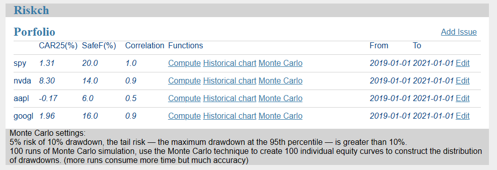
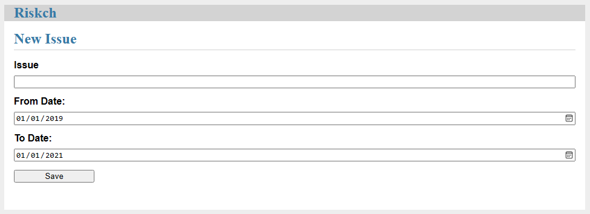
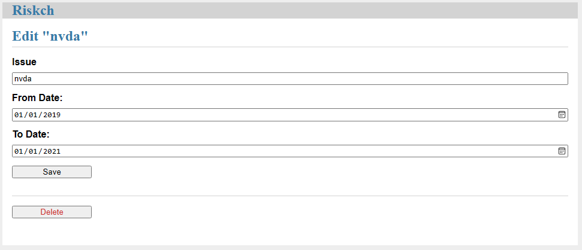
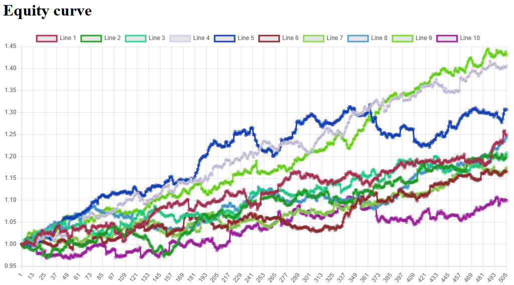
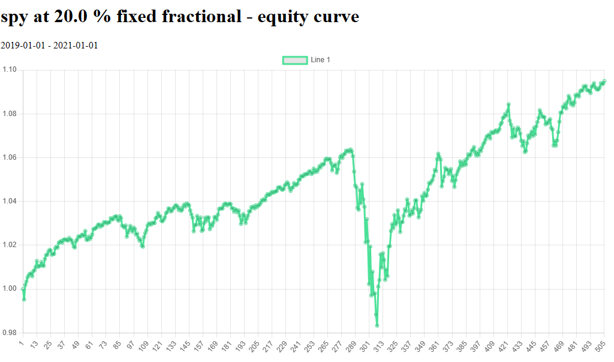

## Perform Metric for Stock Portfolio

### Python/Flask application

Project structure:
```
.
├── Dockerfile
├── requirements.txt
├── instance
├── riskch
    ├── static
    ├── templates
    ├── __init__.py
    ├── chart.py
    ├── compute.py
    ├── db.py
    ├── mpool.py
    └── schema.sql

```

## Deploy with docker

```
docker run -dp 8001:8001 karl8080/pyrisk
```

## Expected result

Listing containers must show one container running and the port mapping as below:
```
$ docker ps
CONTAINER ID   IMAGE     COMMAND                  CREATED         STATUS         PORTS                    NAMES
78e6c069e2f3   pyrisk    "flask --app app.mai…"   7 seconds ago   Up 4 seconds   0.0.0.0:8001->8001/tcp   optimistic_meninsky
```

After the web application starts, navigate to `http://localhost:8001` in your web browser:





At the first page, you can add, edit, delete and compute the perform metric. For demo, I typical select CAR25 from the book of Dr. Howard Bandy - Quantitative Technical Analysist. Also compute the Correlation coefficient to the market, preset to "spy".

* Click on the Equity Curve to check the 10 equally likely equity curves from the Monte Carlos simulation:



* Equity Curve at Safe F.



## Terms

CAR25 is a conservative metric that can be used to compare alternative uses of funds.  It is the compound annual rate of return for the risk normalized profit at the 25th percentile of the distribution

SAFEF is the fixed percentage position size at the trade system.

## Assumptions and Limitations

During calculation, assume:
* the position sizing can be more 100% of account, maximum is 400%,
* 0 interest rate,
* buy with fixed fractional position sizing every trades everyday,
* commission omit

## Debug related commands

Run The Application
```
flask --app riskch run --debug
```

Initialize the Database File
```
flask --app riskch init-db
```
